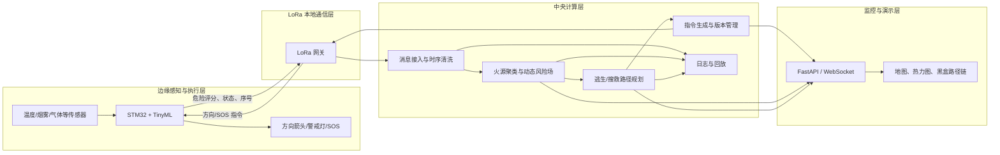

# 智能消防逃生与搜救指示系统（小黑盒）工程实施文档

> 文档版本：V1.1  
> 编制日期：2026-07-12  
> 文档性质：需求基线、总体设计与实施指导  
> 适用对象：硬件组、嵌入式组、LoRa 通信组、算法后端组、前端可视化组、系统测试组

> **V1.1 修订重点**：增加跨地图初始化与编译接口、半自动小黑盒布点、布点优化与冗余校验、多危险场分层建模、传感器—模型融合、跨地图回归测试以及分层参数标定方法。

---

## 0. 文档目的

本文档对现有项目材料进行统一整理，形成一份能够直接指导后续研发、联调、演示和验收的工程文档。重点解决以下问题：

1. 明确项目真正要解决的工程问题，而不是停留在算法展示或人群动画层面。
2. 统一“小黑盒、LoRa、边缘 AI、中央计算、动态路径规划、逃生指示、消防搜救”之间的职责边界。
3. 消除现有材料中关于火势传播、D* Lite、SOS 熔断、箭头保留方式等口径不一致的问题。
4. 给出从地图建模、传感器上报、风险场生成、路径重规划到终端指示的完整实现步骤。
5. 给出接口、数据结构、测试场景、验收指标和迭代顺序，避免各模块独立开发后无法集成。
6. 将不同建筑地图的差异封装在地图初始化与编译层中，使风险计算、路径规划和指令生成算法不依赖某一张固定地图。
7. 给出小黑盒位置的人工配置、自动生成、半自动校正和优化评估方法。
8. 区分火焰、温度、烟雾、CO 和可见度等不同危险因素，建立可测试、可标定的多层风险模型。

本文档中的“云端”统一指**建筑内部或现场网关附近的中央计算节点**，可以是本地服务器、工控机或边缘计算盒，不要求依赖公网。LoRa 网络负责在建筑内部完成低速、远距离、低功耗通信；即使外部互联网中断，系统仍应能够在本地闭环运行。

---

# 1. 项目需求与定位

## 1.1 项目背景

传统消防疏散指示牌通常只能给出固定方向。当火灾封锁原有出口、局部通道被高温或毒气覆盖时，固定箭头可能继续将人员引向已失效的路线。单个传感器节点虽然能够感知附近环境，却无法判断远处出口是否仍然可达，也无法掌握整栋建筑的全局火情。

本项目拟构建一套由高密度“小黑盒”组成的智能消防逃生与搜救指示系统：

- 小黑盒采集温度、烟雾、有毒气体等环境信息；
- STM32 上运行轻量级 TinyML 模型，输出离散火灾危险评分；
- 危险评分通过 LoRa 星型网络上传至中央计算节点；
- 中央节点结合建筑地图和全楼报警信息生成动态风险地图；
- 路径规划引擎为每个小黑盒计算应显示的绝对方向；
- 小黑盒通过绿色箭头、警戒灯或红色 SOS 状态向现场人员提供反馈；
- 当不存在可生存的逃生路线时，系统停止向群众提供危险突围指令，同时在后台保留供消防员使用的搜救路线。

## 1.2 项目核心价值

项目的核心不是单独展示 D* Lite 算法，也不是模拟人群在地图中自由移动，而是建立一条完整的工程闭环：

> 环境感知 → 边缘判断 → LoRa 上报 → 全局风险融合 → 动态路径计算 → 小黑盒方向下发 → 逃生与搜救状态反馈。

路径规划是系统的重要支撑模块，但项目整体重点仍是：

1. 火灾断网场景下的本地 LoRa 通信；
2. STM32 端的轻量级火灾危险识别；
3. 全楼范围的动态逃生指示；
4. 极端情况下的安全熔断与搜救辅助。

## 1.3 目标用户与使用场景

### 1.3.1 受困群众

群众无需持有手机或专用终端，只需观察沿途小黑盒的灯光和箭头：

- 绿色箭头：存在可生存的逃生路径；
- 警戒状态：附近环境异常，需要加快撤离并注意风险；
- 红色 SOS：系统未找到满足生存约束的出口路径，应停止盲目突围，转向就近避难或等待救援。

### 1.3.2 消防救援人员

消防员通过专用后台或战术终端查看：

- SOS 节点位置；
- 各楼层风险热力图；
- 从出口到 SOS 节点的高风险但物理可达路线；
- 节点在线状态、最后上报时间和风险变化趋势。

### 1.3.3 系统运维人员

运维人员负责：

- 建筑地图、出口、避难点和小黑盒位置配置；
- 节点在线监控和电量维护；
- 路径规划参数标定；
- 演练回放、日志分析和故障定位。

---

# 2. 系统边界与当前版本范围

## 2.1 当前版本必须完成的功能

1. 导入真实建筑平面掩码并建立可通行网格。
2. 配置安全出口、避难点和小黑盒固定坐标。
3. 接收小黑盒上传的危险评分和状态信息。
4. 对传感器信息进行去重、时序滤波、聚类和合法性检查。
5. 模拟或计算具有中心高、外围低特征的动态火灾风险场。
6. 保证风险传播不穿透墙体，不允许路径穿墙、斜穿墙角或贴着火焰边缘钻过危险缝隙。
7. 计算距离、风险和转弯次数共同作用下的路径代价。
8. 支持多出口场景，为全楼小黑盒生成统一方向场。
9. 火势变化后只更新受影响区域，或者在早期版本中先保证正确地完成全图重算。
10. 将路径结果降维为每个小黑盒的方向指令。
11. 以路径链形式可视化黑盒之间的完整连接关系。
12. 当逃生路径不可生存时触发红色 SOS，并在后台保留消防搜救路线。
13. 支持多火源、墙体隔断、火势交汇、节点失联和网关失联等演示场景。
14. 保存事件日志，支持复盘每一帧风险图、路径和下发指令。
15. 以标准地图包加载不同建筑，完成坐标、语义图层、出口、楼梯、避难点和黑盒位置的统一初始化。
16. 支持小黑盒候选点自动生成、人工修正、覆盖校验和 N-1 单点失效验证。
17. 对火焰、烟雾、温度、CO 和可见度进行分层建模，最终生成逃生代价图与搜救代价图。
18. 建立固定场景、多地图和参数版本化的自动回归测试流程。

## 2.2 当前版本不作为主线的功能

以下内容可以保留为后续研究方向，但不应阻塞当前工程闭环：

- 大规模人群粒子仿真；
- 社会力模型和踩踏动力学；
- 强化学习直接输出逃生决策；
- LoRa 节点之间的 Mesh 自组网；
- 高精度 CFD/FDS 火灾流体仿真；
- 多楼宇、跨园区统一调度；
- 消防员实时定位与姿态跟踪。

现有前端中的 `particles.js`、社会力模型和随机人群初始化属于旧的展示方向。当前版本应以**固定小黑盒、方向箭头、风险热力图和路径链动态重连**为主要可视化对象。

---

# 3. 统一后的关键技术决策

## 3.1 中央计算节点不等于公网云平台

系统必须能够在公网断开时运行。因此中央计算服务建议部署在建筑本地：

- LoRa 网关旁的工控机；
- 消防控制室服务器；
- 带备用电源的边缘计算盒。

浏览器前端、FastAPI 和 WebSocket 只服务于本地监控和演示，不依赖外部云服务。

## 3.2 当前通信拓扑采用 LoRa 星型网络

小黑盒只与中央网关通信，不在当前版本中进行节点间 P2P 广播，原因包括：

- 降低协议复杂度；
- 避免高并发报警时形成广播风暴；
- 便于统一时钟、节点管理和消息去重；
- 确保路径决策由具有全局视野的中央节点完成。

Mesh 或 BLE/Zigbee 降级网络可作为后续课题，不应在当前版本中同时实现。

## 3.3 路径规划与小黑盒部署解耦

不建议通过人为降低“小黑盒所在网格”的路径代价，强迫算法绕路经过黑盒。安全路径应首先由建筑可通行空间和风险代价决定，小黑盒只是路径的物理展示锚点。

工程上应通过以下方式保证路径可被连续指示：

1. 小黑盒部署在走廊中心线；
2. 所有转弯、交叉口、出口、避难点和关键门口强制部署；
3. 长直走廊按照最大可视距离或探测半径插值部署；
4. 规划出的连续网格路径再映射成“当前黑盒 → 下一个黑盒/出口”的链。

这样不会因为“黑盒低代价”而生成不符合实际安全原则的绕行路径。

## 3.4 火势传播采用墙体约束的迭代传播模型

仅在普通高斯卷积后执行一次哈达玛积，虽然能够将墙体位置清零，但不能严格阻止危险值从薄墙一侧卷积到另一侧。因此当前工程主方案应采用：

- 墙体约束的元胞自动机；或
- 每一步都施加传播掩码的迭代卷积；或
- 基于可传播拓扑的测地距离扩散。

最终的建筑掩码不是只在最后使用一次，而是必须参与每一步邻域传播。

## 3.5 采用逃生与搜救双代价模式

单一代价图无法同时满足“群众绝不能被引导穿越致命区域”和“消防员仍需要一条进入高危区的路线”两个目标。

因此系统维护两种规划模式：

### 逃生模式 `ESCAPE`

- 墙体：不可通行；
- 致命火灾区域：不可通行；
- 中低风险区域：按风险程度增加代价；
- 目标：安全出口，必要时切换为避难点；
- 输出：绿色逃生箭头、避难方向或红色 SOS。

### 搜救模式 `RESCUE`

- 墙体：不可通行；
- 火灾区域：高代价但保持有限值；
- 目标：SOS 小黑盒或受困区域；
- 输出：只展示在消防后台或专用终端，不作为群众绿色逃生箭头。

这种设计比“所有火灾都设为有限代价，再用一个阈值判断”更清晰，也能避免群众显示层和消防搜救层互相冲突。

## 3.6 D* Lite 的工程口径

系统采用“D* Lite/LPA* 风格的反向增量最短路引擎”。多出口通过超级目标节点统一处理，启发式函数可设为 0，此时算法实质上是增量式 Dijkstra。

必须避免以下不严谨表述：

- 不能声称任何场景均为 `O(1)`；
- 不能在未经测试时声称固定“毫秒级”；
- 不能声称一定存在安全路径；
- 算法只能保证在给定图和代价模型下找到最小代价可达路径。

实际性能应通过地图规模、变化网格数量、优先队列操作次数和 P95 更新延迟进行测量。


## 3.7 地图差异必须由初始化与编译层吸收

路径规划核心不得直接解析 PNG、CAD 或某一张地图中的硬编码坐标，也不得在算法内部写死出口、黑盒和楼梯位置。不同建筑的差异应先被编译成统一的 `CompiledMap`，随后风险引擎和路径规划器只依赖以下标准对象：

```text
CompiledMap:
    map_id
    map_version
    resolution_m_per_cell
    coordinate_system
    semantic_layers
    topology_graph
    exits
    refuges
    stairs
    doors
    black_boxes
    propagation_models
    static_cost_layers
```

初始化流程应满足：

> 原始地图与配置 → 合法性校验 → 坐标归一化 → 语义图层构建 → 中心线和拓扑提取 → 黑盒布点 → 静态连通性自检 → 规划器初始化 → 生成不可变地图快照。

运行期间，算法只接收动态传感器和危险场变化。若建筑结构、出口或黑盒位置发生改变，应生成新的 `topology_version`，重新完成初始化，而不是在旧状态上隐式修改。

该设计是系统泛用性的基础：**更换地图时替换地图包和初始化产物，不修改 D* Lite、风险代价函数、指令链和 LoRa 协议核心代码。**

---

# 4. 总体架构




## 4.1 地图编译层与运行时算法层

总体软件架构进一步划分为两条生命周期不同的管线：

### 离线或部署期：地图编译管线

```text
原始平面图/BIM/CAD/人工掩码
    → MapLoader
    → SemanticLayerBuilder
    → ClearanceBuilder
    → CenterlineExtractor
    → TopologyBuilder
    → BoxCandidateGenerator
    → PlacementOptimizer
    → MapValidator
    → CompiledMap
```

该管线在建筑首次部署、地图修订或设备位置调整时运行。其输出应落盘并带版本号，不需要在每个 Tick 中重复执行。

### 在线运行期：动态决策管线

```text
传感器帧
    → 数据清洗与置信度
    → 多危险场更新
    → 逃生/搜救代价图
    → 增量路径修复
    → 黑盒方向与路径链
    → LoRa 差异下发
```

在线管线只能读取经过验证的 `CompiledMap`。地图未通过静态自检时，系统不得进入正式运行模式。

## 4.2 端到端数据流

1. 小黑盒周期采样或由硬件阈值中断唤醒。
2. STM32 对传感器输入执行校验和 TinyML 推理。
3. 节点形成危险评分 `danger_score`，通过 LoRa 上传。
4. 中央服务在一个 Tick 时间窗内聚合所有消息。
5. 系统完成消息去重、时序滤波、置信度计算和火场聚类。
6. 火势模型更新风险地图 `M_risk`。
7. 风险地图转换为逃生代价图和搜救代价图。
8. 路径引擎更新 `g/rhs` 状态场。
9. 指令模块为每个小黑盒生成方向、模式和有效期。
10. LoRa 网关将差异指令下发到对应节点。
11. 前端只绘制发生变化的风险区域、黑盒状态和路径链。

---

# 5. 建筑地图与物理空间建模

## 5.1 坐标约定

建议统一采用二维数组坐标：

- `x`：列号，向右增大；
- `y`：行号，向下增大；
- 原点：建筑图左上角；
- 北：`(0, -1)`；
- 东：`(+1, 0)`；
- 南：`(0, +1)`；
- 西：`(-1, 0)`。

所有后端、前端、地图配置和固件方向码必须使用同一约定。

## 5.2 地图分层

不要用一个 `M_mask` 承担所有语义。建议至少维护以下图层：

| 图层 | 含义 | 典型数据类型 |
|---|---|---|
| `M_walkable` | 人员可通行区域 | `bool[H,W]` |
| `M_wall` | 墙体和永久障碍 | `bool[H,W]` |
| `M_fire_domain` | 火焰、烟气允许传播的区域 | `bool[H,W]` |
| `M_material` | 材质或燃烧参数，可选 | `uint8/float` |
| `M_clearance` | 到最近墙体的距离 | `float[H,W]` |
| `M_box` | 小黑盒编号映射 | `int[H,W]` |
| `M_exit` | 安全出口编号映射 | `int[H,W]` |
| `M_refuge` | 避难点编号映射 | `int[H,W]` |
| `M_risk` | 当前风险值 | `float[H,W]` |

`M_walkable` 与 `M_fire_domain` 不一定完全相同。例如烟气可以通过门缝或房间传播，但人员未必能够穿墙；后续若没有足够建筑数据，MVP 可以先令二者一致。

## 5.3 小黑盒部署算法

### 5.3.1 强制部署点

以下位置必须配置小黑盒：

- 所有交叉路口；
- 所有非直线转弯处；
- 走廊盲端；
- 安全出口前；
- 避难点入口；
- 楼梯间入口；
- 防火门两侧；
- 需要改变方向的关键节点。

### 5.3.2 走廊中心线提取

1. 对 `M_walkable` 执行骨架化，获得一像素宽中心线。
2. 统计骨架像素的邻接度数。
3. 度数大于 2：交叉口；
4. 度数等于 2 且两个方向不共线：转弯；
5. 度数等于 1：盲端或出口候选。

### 5.3.3 长直走廊插值

若相邻关键黑盒之间的中心线距离超过最大允许间距 `D_box_max`，在中心线上等距插入辅助黑盒。`D_box_max` 应由以下因素共同确定：

- 人员正常视距；
- 烟雾环境下有效视距；
- LED 箭头亮度；
- 黑盒传感器探测半径；
- 建筑消防规范和实际安装条件。

### 5.3.4 部署验证

生成坐标后必须执行：

- 是否位于走廊中心线；
- 是否与墙体保持安装距离；
- 相邻黑盒之间是否沿中心线连通；
- 任意转弯处是否至少有一个黑盒；
- 从任意黑盒到至少一个出口或避难点是否存在静态拓扑路径；
- 是否存在连续多个黑盒方向相互指向形成环路。


## 5.4 标准地图包与初始化接口

### 5.4.1 地图包目录

每栋建筑应使用独立地图包，禁止把地图相关数据散落在代码中：

```text
maps/
└─ building_A/
   ├─ map_config.yaml             # 地图元信息与坐标约定
   ├─ floors/
   │  ├─ F01_walkable.png
   │  ├─ F01_wall.png
   │  ├─ F01_material.npy
   │  └─ F01_semantic.json
   ├─ exits.json
   ├─ refuges.json
   ├─ stairs.json
   ├─ doors.json
   ├─ vents.json                  # 可选，烟雾传播使用
   ├─ gateways.json
   ├─ black_boxes.manual.json     # 人工强制点与修正点
   ├─ placement_config.yaml
   ├─ hazard_config.yaml
   └─ planner_config.yaml
```

`map_config.yaml` 至少包含：

```yaml
map_id: building_A
map_version: 1.0.0
resolution_m_per_cell: 0.10
coordinate_origin: top_left
x_axis: east
y_axis: south
floors: [F01, F02, F03]
default_unit: meter
```

所有输入坐标必须明确是“世界坐标（米）”还是“网格坐标（行列）”。推荐对外配置使用米，编译后转换为整数网格坐标，并保留双向转换函数。

### 5.4.2 初始化生命周期

```python
class MapInitializer:
    def load_package(self, map_dir: str): ...
    def validate_source_files(self): ...
    def normalize_coordinates(self): ...
    def build_semantic_layers(self): ...
    def build_clearance_layers(self): ...
    def extract_centerlines(self): ...
    def build_topology(self): ...
    def generate_box_candidates(self): ...
    def optimize_box_placement(self): ...
    def build_propagation_models(self): ...
    def run_static_self_tests(self): ...
    def compile(self) -> "CompiledMap": ...
```

初始化失败必须返回结构化错误，例如：

```text
MAP_E001: 出口位于不可通行区域
MAP_E002: 楼梯上下层连接不一致
MAP_E003: 黑盒未吸附到合法中心线
MAP_E004: 某关键转弯未被指示节点覆盖
MAP_E005: 某区域静态状态下无法到达出口或避难点
MAP_E006: 烟雾传播图存在未定义渗透系数
```

### 5.4.3 编译产物

```python
@dataclass(frozen=True)
class CompiledMap:
    map_id: str
    map_version: str
    resolution: float
    floors: dict[str, "FloorLayers"]
    topology_graph: "TopologyGraph"
    exits: tuple["Exit", ...]
    refuges: tuple["Refuge", ...]
    stairs: tuple["VerticalLink", ...]
    doors: tuple["Door", ...]
    black_boxes: tuple["BlackBox", ...]
    placement_report: "PlacementReport"
    validation_report: "MapValidationReport"
```

建议将编译产物保存为 `compiled_map.npz + compiled_map.json`。运行服务启动时先校验哈希、地图版本和配置版本，再初始化路径规划器。

## 5.5 地图编译的具体步骤

### 5.5.1 语义化与人工复核

原始平面图必须转换为墙体、可通行区域、门、楼梯、房间、出口、避难点、通风口等语义图层。当前原型可采用人工标注或半自动分割；后续可以增加 CAD/BIM 解析，但不得让 CAD 解析阻塞 MVP。

### 5.5.2 安全净空图

利用距离变换计算每个可通行单元到墙体的距离：

$$
M_{clearance}(x,y)=\operatorname{dist}\big((x,y),M_{wall}\big)
$$

根据人体占用宽度、安装误差和风险缓冲，生成不同模式的有效通行域：

```python
walkable_escape = M_walkable & (M_clearance >= clearance_escape)
walkable_rescue = M_walkable & (M_clearance >= clearance_rescue)
```

逃生模式通常采用更保守的净空，搜救模式可根据装备与任务要求单独配置。

### 5.5.3 骨架与拓扑压缩

骨架像素用于定位走廊中心，但路径规划是否直接在高分辨率网格上运行应由性能测试决定。无论使用网格图还是压缩拓扑图，都必须保留从拓扑节点到原始网格路径的映射，以便：

- 计算真实距离和转弯；
- 检查净空；
- 绘制路径；
- 将黑盒吸附到物理位置；
- 将动态风险重新映射到拓扑边。

### 5.5.4 多楼层连接

楼梯、电梯前室和连廊应建模为明确的垂直边：

```text
VerticalLink:
    source_floor, source_anchor
    target_floor, target_anchor
    link_type: STAIR | FIRE_STAIR | RAMP
    direction: BIDIRECTIONAL | UP_ONLY | DOWN_ONLY
    base_cost
    smoke_permeability
    fire_permeability
    capacity
```

普通电梯不应默认作为火灾逃生路径，是否可用必须由建筑配置显式声明。

## 5.6 小黑盒位置的三种配置方式

### 5.6.1 人工强制配置

适用于出口、消防楼梯、防火门、配电室附近等必须由工程人员确认的位置。人工点具有最高优先级，但仍需通过合法性和可见性校验。

```json
{
  "box_id": "F01-B032",
  "floor": "F01",
  "world_x_m": 15.4,
  "world_y_m": 8.2,
  "mandatory": true,
  "mount_type": "CEILING_SENSOR_WALL_INDICATOR",
  "sensor_radius_m": 5.0,
  "nominal_visibility_m": 8.0
}
```

### 5.6.2 自动生成

自动生成器依据以下优先级产生候选点：

1. 出口、避难点和消防楼梯入口；
2. 交叉口和方向决策点；
3. 非直线转弯；
4. 盲端与房间汇入口；
5. 防火门两侧；
6. 长直走廊补点；
7. 高风险功能区的冗余点。

### 5.6.3 半自动地图编辑器

工程部署推荐采用“自动生成 + 人工拖动修正 + 自动复检”的方式。编辑器至少应支持：

- 添加、删除、拖动黑盒；
- 自动吸附至中心线或合法安装带；
- 显示传感覆盖半径和烟雾条件下的有效视距；
- 显示相邻黑盒的视线和中心线路径；
- 标出未覆盖转弯、盲区和断链；
- 模拟删除任意一个节点后的链路变化；
- 保存人工覆盖层，而不直接修改自动生成算法的结果文件。

## 5.7 科学布点模型

### 5.7.1 硬约束与软目标分离

布点优化必须先满足硬约束：

- 所有强制位置均有节点；
- 每个方向决策点在人员到达前可观察到指示；
- 相邻指示锚点之间存在合法中心线路径；
- 静态无火状态下，每个黑盒链能够到达出口或指定避难点；
- 关键区域满足冗余要求；
- 节点不得位于墙体、门扇运动区或无法维护的位置。

只有满足硬约束后，才优化黑盒数量、采购成本和平均间距。

### 5.7.2 覆盖与视线约束

设 `R_detect` 为传感器有效探测半径，`R_visible_smoke` 为烟雾环境下经实验得到的有效识别距离，建议：

$$
D_{box,max}\le \eta\min(R_{detect},R_{visible\_smoke}),\quad 0<\eta<1
$$

该公式只是初始布点上限，不能替代视线检查。两个节点即使欧氏距离很近，只要隔墙、跨越转角或不在同一走廊段，就不能认为构成连续指示链。

```python
def can_chain(a, b, compiled_map):
    return (
        centerline_distance(a, b) <= D_box_max
        and same_navigable_component(a, b)
        and direction_is_unambiguous(a, b)
        and installation_visibility_ok(a, b)
    )
```

### 5.7.3 集合覆盖优化

从中心线和关键结构生成候选点集合 $C=\{c_1,\ldots,c_m\}$，令 $x_i\in\{0,1\}$ 表示是否选择候选点。可建立如下基础模型：

$$
\min J=\sum_i cost_i x_i
+\lambda_b N_{blind}
+\lambda_a N_{ambiguous}
+\lambda_m C_{maintenance}
$$

约束：

$$
\sum_{i\in Cover(p)}x_i\ge k_p,\quad \forall p\in P_{sample}
$$

其中普通走廊可令 $k_p=1$，出口、楼梯、关键路口可令 $k_p\ge2$。

当前工程推荐采用以下确定性流程：

1. 强制加入必选点；
2. 使用贪心集合覆盖补齐盲区；
3. 在长直走廊进行间距插值；
4. 逐个尝试删除非强制点，若所有约束仍满足则判为冗余；
5. 对关键区域执行人工复核。

若后续节点规模较大，可使用整数线性规划求解，不建议在当前阶段优先使用难以复现的遗传算法。

### 5.7.4 布点评价指标

`PlacementReport` 至少输出：

| 指标 | 含义 |
|---|---|
| `box_count` | 总节点数量 |
| `mandatory_count` | 强制节点数量 |
| `coverage_ratio` | 走廊采样点覆盖率 |
| `max_blind_distance_m` | 最大连续指示盲区 |
| `decision_lead_distance_m` | 到达路口前可观察到指示的距离 |
| `chain_break_count` | 静态指示链断点数 |
| `ambiguous_direction_count` | 方向存在歧义的节点数 |
| `n_minus_1_pass_rate` | 删除任意单节点后的关键区域覆盖通过率 |
| `sensor_overlap_ratio` | 传感器交叉覆盖比例 |
| `estimated_cost` | 设备、布线和维护估算成本 |

## 5.8 冗余与 N-1 失效验证

关键出口、消防楼梯和主要咽喉不得依赖单个节点。地图编译器应自动执行：

```python
for box in critical_or_all_boxes:
    temporarily_disable(box)
    validate_coverage()
    validate_instruction_chain()
    validate_gateway_reachability()
    record_failure_impact(box)
```

N-1 验证不要求所有普通区域在任意节点失效后都保持完全相同的服务，但必须明确：

- 哪些区域仍能获得完整方向链；
- 哪些区域降级为保持上一指令或异常警示；
- 哪些关键位置需要增加冗余节点；
- 单点故障是否会造成大范围方向链断裂。

## 5.9 地图泛化验收

算法是否“适配不同地图”不能只通过更换图片后成功启动来判断。至少应在以下结构差异明显的地图上回归：

- 单走廊双出口；
- 多交叉口教学楼；
- 环形走廊建筑；
- 多楼层消防楼梯；
- 存在中庭、隔墙和防火门的复杂平面。

每张新地图均应做到：

1. 不修改路径规划核心代码；
2. 仅通过地图包和配置完成初始化；
3. 自动生成验证报告；
4. 静态路径、火灾传播和动态重规划测试全部通过；
5. 参数若需改变，必须明确属于地图参数、硬件参数还是全局算法参数。

---

# 6. 边缘小黑盒设计

## 6.1 边缘职责

小黑盒只负责：

1. 传感器采样；
2. 输入异常校验；
3. TinyML 火灾危险评分；
4. LoRa 上报；
5. 接收中央指令；
6. 驱动箭头、警戒灯、SOS 灯和蜂鸣器；
7. 在通信失效时进入安全降级状态。

小黑盒不负责全局寻路，不需要存储完整建筑地图。

## 6.2 TinyML 输入输出

传感器数量以实际硬件 BOM 为准，协议不应写死具体四维或五维。推荐统一为：

```text
sensor_vector = [temperature, smoke, toxic_gas, humidity, optional_voltage, ...]
```

TinyML 输出：

```text
danger_score: uint8, 0~100
model_confidence: uint8, 0~100（可选）
sensor_fault_flags: bitset
```

危险评分是压缩后的主要上报信息。调试阶段可选择低频上传原始传感器值，但正式模式应以小载荷为主。

## 6.3 唤醒策略

推荐三级策略：

1. **低频基础采样**：正常状态下定时采样；
2. **硬件或软件死区触发**：变化率超过阈值后提高采样频率；
3. **TinyML 告警触发**：危险评分达到上报阈值后立即发送。

必须保留周期心跳，不能只有发生火灾时才通信，否则服务器无法区分“节点正常但无报警”和“节点损坏或掉线”。

## 6.4 通信失效降级

节点失联不能直接等价为“该区域一定发生火灾”，因为失联也可能来自电池耗尽、射频干扰或网关故障。正确策略为：

1. 在短暂宽限期内保持最后一次有效指令；
2. 超过指令 TTL 后停止显示可能过时的绿色箭头；
3. 切换为红色/黄色通信异常警示；
4. 本地传感器若同时高危，则直接进入 SOS；
5. 服务器对失联节点增加不确定性代价，并结合相邻节点进行判断。

---

# 7. LoRa 数据协议

## 7.1 上行消息

推荐的最小应用层字段：

| 字段 | 含义 |
|---|---|
| `node_id` | 节点唯一编号 |
| `seq` | 递增序号，用于去重和乱序检测 |
| `danger_score` | 0~100 危险评分 |
| `status_flags` | 传感器故障、低电量、SOS 按键等 |
| `battery` | 电量或供电状态，可选 |
| `timestamp_delta` | 相对时间，可选 |

LoRa 链路本身已有帧校验，但在需要跨模块转发时仍建议保留应用层长度和版本字段。

## 7.2 下行指令

现有方向码可以保留：

| 指令码 | 动作 |
|---|---|
| `0x01` | 绿色向北箭头 |
| `0x02` | 绿色向南箭头 |
| `0x03` | 绿色向东箭头 |
| `0x04` | 绿色向西箭头 |
| `0x11~0x14` | 警戒/避难模式下的对应方向，可选 |
| `0xF0` | 通信或系统异常警示 |
| `0xFF` | 红色 SOS，关闭群众绿色逃生箭头 |

每条指令在服务器端必须关联：

- `map_version`；
- `command_version`；
- `issued_at`；
- `ttl`；
- `reason_code`。

这些元数据可以由网关协议承载，不一定全部进入小黑盒的单字节应用命令。

## 7.3 差异下发

中央节点只向以下小黑盒下发更新：

- 方向发生改变；
- 模式发生改变；
- 指令即将过期；
- 节点重新上线；
- 全局地图版本切换。

这样可以降低 LoRa 下行占用。

---

# 8. 消息接入、数据清洗与火源聚类

## 8.1 Tick 聚合

中央服务以可配置 Tick 周期运行。建议开发阶段从 `100~500 ms` 范围内测试，最终值根据节点数量、LoRa 空口占用和服务器性能确定。

每个 Tick 执行：

1. 读取新消息；
2. 按 `node_id + seq` 去重；
3. 丢弃明显过期消息；
4. 更新节点在线状态；
5. 对危险评分执行时间滤波；
6. 计算消息置信度；
7. 形成当前 Tick 的有效报警集合。

## 8.2 时间滤波与异常值处理

推荐同时使用：

- 指数移动平均，抑制单帧抖动；
- 上升沿快速、下降沿慢速的非对称滤波；
- 邻域一致性校验；
- 单节点突变隔离；
- 连续多帧确认机制。

不能因为一个节点单帧输出 100 分就立即封锁关键通道。若相邻节点均无异常，应降低该数据的置信度，并标记传感器故障待核查。

## 8.3 火场聚类

多个相邻报警节点可能属于同一火场，也可能被墙体分隔为两个独立火源。不能只使用欧氏距离聚类，否则隔墙相邻的两个火源会被错误合并。

推荐步骤：

1. 将报警节点投影到 `M_fire_domain`；
2. 基于传播拓扑计算测地距离；
3. 在限定深度或距离内执行 BFS/连通域聚类；
4. 不允许聚类路径穿越墙体；
5. 每个聚类独立生成火源锚点和强度。

## 8.4 火源锚点

可用危险评分作为权重计算加权质心：

$$
X_c=\frac{\sum_i x_i S_i}{\sum_i S_i},\qquad
Y_c=\frac{\sum_i y_i S_i}{\sum_i S_i}
$$

但实际注入风险场时，推荐使用**加权中位点或加权 medoid**，或者将质心投影到同一火场传播连通域内的最近合法单元，避免质心落入墙体、中庭或另一个连通区域。

若质心非法：

1. 从质心附近开始 BFS；
2. 只在当前火场的传播连通域内搜索；
3. 找到最近合法单元；
4. 记录原始质心和投影后锚点，便于调试。


## 8.5 传感器观测与模型预测融合

系统不能只相信传播模型，也不能把离散传感器评分直接当作完整风险场。建议为每个网格维护：

```text
ObservationState:
    observed_value
    predicted_value
    fused_value
    confidence
    last_observed_at
    source_nodes
```

融合可采用可解释的置信度加权：

$$
H_{fused}=\alpha H_{sensor}+(1-\alpha)H_{model}
$$

其中 $\alpha$ 不是固定常数，而应根据以下因素计算：

- 报警节点数量和空间一致性；
- 传感器健康状态；
- 数据新鲜度；
- 单点突变程度；
- 模型与历史趋势的一致性；
- 节点是否失联。

失联节点不得无条件设为最高火灾值。建议区分：

1. **单节点失联、邻域正常**：优先判断为设备或链路故障，增加不确定性代价；
2. **相邻多个节点失联且周围风险快速上升**：提高该区域发生高温损毁的概率；
3. **同一网关下大量节点同时失联**：优先判断为网关或通信基础设施故障；
4. **节点恢复上线**：使用时间窗平滑重新融合，避免瞬时解除封锁。

## 8.6 数据质量状态机

每个节点建议维护：

```text
HEALTHY → SUSPECT → DEGRADED → OFFLINE
    ↑          ↓          ↓
    └──── RECOVERING ─────┘
```

不同状态对应不同数据权重和运维告警。节点健康状态与火灾危险状态必须分开，避免“设备故障”和“环境高危”使用同一个标志位。

---

# 9. 动态火灾风险场

## 9.1 火灾生命周期

火灾需要同时表现“原地越烧越旺”和“向外蔓延”两种行为。每个火源维护：

```text
FireSource:
    id
    anchor_x, anchor_y
    intensity
    growth_rate
    spread_rate
    max_intensity
    confidence
    last_update
```

示例增长模型：

$$
I_{t+1}=\min\left(I_{max}, I_t+\alpha\left(1-\frac{I_t}{I_{max}}\right)^p\Delta t+F_{sensor}\right)
$$

其中 `F_sensor` 表示新传感器评分对火源强度的校正。

## 9.2 墙体约束传播

推荐使用掩码元胞自动机：

```python
source = current_fire * M_fire_domain
neighbor_effect = masked_neighbor_spread(source)
new_fire = clip(local_growth(source) + neighbor_effect, 0, fire_max)
new_fire *= M_fire_domain
```

实现要求：

- 每一步传播都检查墙体；
- 禁止对角线穿过墙角；
- 防火门、普通门和开放区域可配置不同传播率；
- 不同材质可通过 `M_material` 调节增长和扩散速度。

## 9.3 多火源融合

MVP 推荐使用逐点最大值：

$$
M_{risk}(x,y)=\max_j M_{risk}^{(j)}(x,y)
$$

优点是不会因多个火源简单相加造成数值爆炸，也容易解释为“该位置由威胁最大的火源决定”。

若后续需要体现多火源叠加，可使用封顶和式：

$$
M_{risk}=\min\left(R_{max},\sum_j w_j M_{risk}^{(j)}\right)
$$

但必须重新标定致命阈值。

## 9.4 防止贴火和狭缝穿越

仅提高火焰网格代价仍可能让算法从火场边缘与墙体之间的一个像素缝隙通过。应增加安全净空约束：

1. 根据风险阈值生成高危二值区域；
2. 按人体宽度、热辐射安全距离和地图分辨率执行形态学膨胀；
3. 使用距离变换计算每个单元到高危区和墙体的最小距离；
4. 净空不足的单元在逃生模式下直接设为不可通行；
5. 搜救模式可保留，但增加高额代价。


## 9.5 多危险场分层建模

单一 `M_risk` 适合早期演示，但不应长期同时代表火焰、温度、烟雾、CO 和可见度。推荐内部维护：

```python
@dataclass
class HazardLayers:
    fire_intensity: np.ndarray
    temperature: np.ndarray
    smoke_density: np.ndarray
    co_concentration: np.ndarray
    visibility: np.ndarray
    structural_uncertainty: np.ndarray
    fused_escape_risk: np.ndarray
    fused_rescue_risk: np.ndarray
```

各层传播规律不同：

| 危险层 | 主要特征 | 传播约束 |
|---|---|---|
| 火焰 | 局部增长、燃料消耗、邻域蔓延 | 防火墙和关闭防火门强阻断 |
| 温度 | 扩散和热传导，通常比明火范围更广 | 墙体可减缓但未必完全为零 |
| 烟雾 | 扩散快、受门缝、通风和楼梯影响 | 使用独立渗透率图 |
| CO | 与烟气相关但应由传感器或独立参数校正 | 可沿空气通道传播 |
| 可见度 | 由烟雾和照明共同决定 | 用于指示可见性与路径风险 |
| 结构不确定性 | 坍塌、失联、未知障碍等 | 主要作为附加代价或硬阻断 |

## 9.6 火焰生命周期模型

建议将“原地增长”和“空间传播”分开：

$$
F_{t+1}(x,y)=\operatorname{clip}\left[
F_t(x,y)+G(x,y,t)+\sum_{n\in N(x,y)}P_{n\rightarrow(x,y)}F_t(n)-D(x,y,t),
0,F_{max}
\right]
$$

- $G$：本地燃烧增强；
- $P$：由材质、门状态、风向等决定的传播系数；
- $D$：燃料耗尽、灭火或自然衰减；
- $F_{max}$：强度上限。

MVP 可先使用固定材质和无风模型，但接口必须保留 `growth_rate`、`spread_rate`、`decay_rate` 和 `material_factor`。

## 9.7 烟雾传播模型

烟雾图不能直接复用人员通行掩码。应建立 `M_smoke_permeability`：

```text
开放走廊           1.00
打开的门           1.00
关闭普通门         0.10~0.30（待实验标定）
关闭防火门         接近 0，但不应凭空设定最终值
通风口/管道        单独配置
实体墙             0
楼梯间             按竖向传播模型配置
```

基础更新形式：

$$
S_{t+1}=\operatorname{clip}\left(
S_t+\kappa_s\,\operatorname{MaskedDiffuse}(S_t,M_{smoke})+Q_{fire}-\lambda_s S_t,
0,S_{max}
\right)
$$

其中参数必须通过实验、公开数据或高保真仿真校正。当前系统的目标是提供可解释的工程近似，不应宣称等价于 FDS/CFD。

## 9.8 温度、CO 与可见度

温度可采用独立扩散场，并由火焰强度作为源项；CO 可先与烟雾相关联，再使用实际气体传感器读数校正。

可见度建议由烟雾浓度推导：

$$
V(x,y)=V_{max}\exp\big(-k_v S(x,y)\big)
$$

该值不仅进入路径风险，还用于判断相邻黑盒在当前烟雾条件下是否仍具有有效视觉连续性。若某段走廊的估计可见距离低于黑盒间距，应：

- 提高该路段逃生代价；
- 在部署阶段提示需要更密集的低位指示；
- 在运行阶段标记为视觉链不可靠；
- 不能简单依赖地图上两点距离判断可见。

## 9.9 综合风险生成原则

综合风险不应只做普通加权平均，否则某一项致命值可能被其他低值抵消。建议采用“硬阈值 + 软代价”两层结构：

```python
fatal_mask = (
    fire_intensity >= fire_fatal
    or temperature >= temperature_fatal
    or co_concentration >= co_fatal
    or clearance_too_small
)

soft_risk = (
    w_fire * phi_fire(fire_intensity)
    + w_temp * phi_temp(temperature)
    + w_smoke * phi_smoke(smoke_density)
    + w_co * phi_co(co_concentration)
    + w_vis * phi_visibility(visibility)
    + w_unc * structural_uncertainty
)
```

逃生模式中 `fatal_mask` 为不可通行；搜救模式中仍保留有限高代价，并根据消防员防护能力单独标定。

## 9.10 危险场实现检查

每次修改传播算法后必须自动验证以下不变量：

- 增加火源强度不能使对应区域风险下降；
- 增加墙体或关闭防火门不能产生新的穿墙传播路径；
- 火源中心在相同材质下不应长期低于外围；
- 所有风险值均在定义范围内，不出现 NaN、负数或溢出；
- 多火源顺序交换不应改变最大值融合结果；
- 减小 Tick 步长后，在相同物理时间上的结果应保持可接受的一致性；
- 模型预测与传感器观测冲突时必须留下可审计记录。

---

# 10. 路径代价模型

## 10.1 状态定义

为了对转向次数计费，将二维位置扩展为带进入方向的状态：

$$
s=(x,y,d_{in}),\quad d_{in}\in\{N,E,S,W\}
$$

一个可通行网格对应最多四个方向状态，因此总状态数约为 `4N`。

## 10.2 正确的状态转移

从状态 `(x, y, d_in)` 出发，选择下一步方向 `d_out`：

```text
nx = x + dx[d_out]
ny = y + dy[d_out]
next_state = (nx, ny, d_out)
```

转移代价：

$$
c(s,s')=\lambda_d L(s,s')+
\lambda_r \Phi(M_{risk}(nx,ny))+
\lambda_t P(d_{in},d_{out})+
\lambda_u U(nx,ny)+
\lambda_c C_{congestion}(nx,ny)
$$

当前 MVP 中拥塞项可暂设为 0。

## 10.3 转向惩罚

| 动作 | 惩罚 |
|---|---:|
| 直行 | `0` |
| 左转/右转 90° | `W_turn` |
| 掉头 180° | `W_uturn` |

不建议默认将掉头设为无穷大，因为盲端或局部封路时可能必须掉头。应设置 `W_uturn > W_turn`，只有在明确的单向通道中才禁止掉头。

## 10.4 逃生代价图

```text
wall / permanent obstacle -> INF
fatal risk / insufficient clearance -> INF
normal corridor -> base distance cost
warning risk -> base + nonlinear risk penalty
uncertain or offline-node area -> base + uncertainty penalty
```

风险函数可采用分段或指数形式，使高风险区域代价快速上升：

$$
\Phi(r)=
\begin{cases}
0, & r<r_0\\
a(r-r_0), & r_0\le r<r_1\\
a(r_1-r_0)+b(e^{k(r-r_1)}-1), & r\ge r_1
\end{cases}
$$

## 10.5 搜救代价图

搜救模式中墙体仍为不可通行，但火灾单元保持有限高代价，并可根据消防员防护等级、氧气余量和通道宽度重新标定。

搜救路径不是“安全路径”，只能称为**在当前模型下综合代价较低的可达路径**，必须在界面中明确标注风险等级。


## 10.6 路径累计暴露与时间因素

若只按每个网格的瞬时风险求和，会忽略通行速度和暴露时间。建议在验证阶段计算：

$$
E(P)=\sum_{v\in P}R(v)\Delta t_v
$$

其中 $\Delta t_v$ 根据网格长度、走廊坡度、楼梯和预计行进速度估算。当前规划器可以先使用等速近似，但应在结果中同时输出：

- 路径长度；
- 预计通过时间；
- 最大单点风险；
- 累计暴露风险；
- 最小净空；
- 转弯和掉头次数。

## 10.7 地图无关的代价接口

路径算法不得直接读取具体传感器或地图文件，应通过统一接口获取边代价：

```python
class CostProvider(Protocol):
    def is_state_valid(self, state, mode) -> bool: ...
    def transition_cost(self, state, next_state, mode) -> float: ...
    def changed_edges(self, old_version, new_version): ...
```

地图静态差异、动态危险场、门状态、净空和不确定性均由 `CostProvider` 组合。D* Lite 只负责维护最短路一致性，因此同一规划器可以适配不同地图和不同风险模型。

---

# 11. 多出口反向增量路径规划

## 11.1 超级目标节点

将所有安全出口状态连接到虚拟超级目标节点 `SUPER_GOAL`，连接代价为 0。这样只需维护一个反向代价场，即可让每个网格自动选择综合代价最低的出口。

对于避难点，可建立独立的 `SUPER_REFUGE`，不要与安全出口混为同一安全等级。

## 11.2 `g` 与 `rhs`

每个状态维护：

- `g(s)`：当前已确认的最小代价估计；
- `rhs(s)`：根据后继状态计算出的单步前瞻值。

$$
rhs(s)=\min_{s'\in Succ(s)}\left(c(s,s')+g(s')\right)
$$

当 `g(s) == rhs(s)` 时，节点一致；风险变化会使局部节点不一致，并进入优先队列。

## 11.3 初始化

```python
for every state s:
    g[s] = INF
    rhs[s] = INF
rhs[SUPER_GOAL] = 0
push(SUPER_GOAL)
compute_until_consistent()
```

早期工程版本可以先使用多源 Dijkstra 完成全图初始化，验证结果后再引入增量更新。

## 11.4 后继状态

```python
def successors(s):
    x, y, d_in = s
    for d_out in DIRECTIONS:
        nx = x + DX[d_out]
        ny = y + DY[d_out]
        if not is_walkable(nx, ny):
            continue
        if cuts_corner(x, y, nx, ny):
            continue
        yield (nx, ny, d_out), transition_cost(s, d_out)
```

## 11.5 前驱状态

增量算法更新依赖 `Predecessors(s)`。对于目标状态 `(x, y, d_in)`，其物理前一位置为：

```text
px = x - dx[d_in]
py = y - dy[d_in]
```

前一状态的进入方向可能为 N/E/S/W，因此最多有四个候选前驱：

```text
(px, py, N), (px, py, E), (px, py, S), (px, py, W)
```

每个候选仍需检查物理合法性和转向约束。

## 11.6 优先级

在全局反向场、启发式为 0 的情况下，可使用：

$$
Key(s)=\left(\min(g(s),rhs(s)),\min(g(s),rhs(s))\right)
$$

也可在第二关键字中加入稳定序号。若后续改为标准单起点 D* Lite，则应恢复标准启发式项和 `k_m`。

## 11.7 风险变化注入

当 `M_risk` 更新后：

1. 计算新旧代价图差异；
2. 使用阈值过滤微小浮点变化，避免全图抖动；
3. 对每个变化单元找出所有受影响的入边；
4. 更新相关状态及其前驱；
5. 将不一致状态加入优先队列；
6. 执行增量收敛。

不能只更新“变化网格自身的四个状态”，因为进入该网格的转移边代价变化后，其物理邻居中的前驱状态也会受影响。

## 11.8 终止条件

若需要全楼梯度场，队列处理到为空。若只关心小黑盒集合，可优化为：

- 所有黑盒相关状态已一致；
- 队列顶部 Key 不再影响任何目标黑盒。

优化前先保证全图版本正确。

---

# 12. 小黑盒方向生成与路径链

## 12.1 状态降维

小黑盒在物理坐标 `(x_b, y_b)` 上只能显示绝对方向。由于黑盒本身向人员提供了新的方向提示，可将它视为“方向重置点”，在第一步选择时不计入人员此前的进入方向。

对每个合法方向 `d`：

$$
J_b(d)=C_{first}(n_d)+g(n_d,d)
$$

其中 `n_d` 是沿方向 `d` 的相邻网格。

选择：

$$
d^*=\arg\min_d J_b(d)
$$

## 12.2 路径追踪到下一个黑盒

从当前黑盒沿最小代价策略逐步追踪，直到遇到：

- 下一个小黑盒；
- 安全出口；
- 避难点；
- 路径失效；
- 最大追踪步数。

生成：

```text
BoxInstruction:
    box_id
    mode: ESCAPE | REFUGE | SOS
    direction: N | E | S | W | NONE
    next_anchor_id
    path_cost
    risk_level
    version
    ttl
```

## 12.3 防止路径环路

路径链必须满足：

- 下一跳势值严格下降，至少下降 `epsilon`；
- 对相等代价使用稳定的固定方向优先级；
- 追踪时维护 visited 集合；
- 发现环路立即标记规划错误，禁止下发绿色箭头；
- 在前端突出显示异常链条，便于定位。

## 12.4 防止箭头频繁闪烁

火场评分轻微波动可能导致两个方向代价交替最优。建议增加滞回：

- 当前方向仍合法时，仅当新方向至少优于 `switch_margin` 才切换；
- 当前方向进入高危或不可通行时立即切换；
- 设置最小保持时间，但安全事件优先于保持时间。

## 12.5 前端路径链绘制

前端应根据 `box_id -> next_anchor_id` 绘制平滑曲线。路径颜色由模式决定：

- 绿色：可生存逃生路径；
- 黄色/橙色：高风险或避难路径；
- 红色：SOS 区域及消防搜救链；
- 灰色虚线：通信失效或数据过期。

当局部方向改变时，只重绘受影响链段，不需要重新绘制全图。

---

# 13. 生命熔断、避难与消防搜救

## 13.1 逃生可行性判断

不要仅使用一个未经解释的总路径代价阈值。推荐同时检查：

1. 是否存在到出口的拓扑路径；
2. 路径是否经过致命风险单元；
3. 路径最大单点风险；
4. 路径累计风险；
5. 预计通过时间和风险增长趋势；
6. 路径净空是否满足要求。

MVP 可以先采用“致命单元硬阻断 + 累计风险阈值”组合。

## 13.2 决策优先级

对每个黑盒按以下顺序决策：

1. 存在满足逃生约束的出口路径：显示绿色箭头；
2. 无安全出口路径，但存在可用避难点路径：显示避难模式箭头；
3. 出口和避难点均不可达或均超出阈值：显示红色 SOS；
4. 后台计算并保存搜救路线，不向群众显示绿色突围箭头。

## 13.3 搜救路线

消防后台以出口为起点，目标为 SOS 节点。可采用两种方式：

- 从 SOS 节点沿 `g_rescue` 递减方向追踪到出口，再反转路径；
- 将 SOS 集合连接为搜救超级目标，直接计算出口到 SOS 的路线。

界面必须显示：

- 路线累计风险；
- 最大风险点；
- 预计长度；
- 失联节点；
- 当前数据时间戳。

## 13.4 群众显示与消防显示分离

当黑盒处于 SOS 状态时：

- 群众侧硬件：红色 SOS，不显示可能误导的绿色方向；
- 服务器：保留 `rescue_direction` 和完整搜救路径；
- 消防终端：在授权模式下显示搜救方向。

这解决了“红色 SOS 时箭头应关闭”与“仍要为消防员保留路线”的冲突。

---

# 14. 后端软件设计

## 14.1 推荐目录结构

```text
backend/
├─ app/
│  ├─ main.py                 # FastAPI 启动与生命周期
│  ├─ config.py               # 参数加载与校验
│  ├─ models/
│  │  ├─ map_model.py
│  │  ├─ compiled_map.py
│  │  ├─ hazard_layers.py
│  │  ├─ placement_report.py
│  │  ├─ node_state.py
│  │  ├─ fire_source.py
│  │  └─ command.py
│  ├─ services/
│  │  ├─ map_loader.py        # 地图包读取与版本校验
│  │  ├─ map_compiler.py      # 语义图层、净空与拓扑编译
│  │  ├─ placement.py         # 黑盒候选生成与布点优化
│  │  ├─ map_validator.py     # 地图与布点静态自检
│  │  ├─ lora_ingest.py       # 网关消息接入
│  │  ├─ node_registry.py     # 节点在线状态
│  │  ├─ event_filter.py      # 去重、滤波、置信度
│  │  ├─ fire_cluster.py      # 火场聚类和锚点
│  │  ├─ fire_dynamics.py     # 火焰增长与传播
│  │  ├─ smoke_dynamics.py    # 烟雾传播
│  │  ├─ thermal_dynamics.py  # 温度与气体场
│  │  ├─ hazard_fusion.py     # 观测融合与综合风险
│  │  ├─ cost_map.py          # 逃生/搜救代价图
│  │  ├─ planner.py           # 增量路径引擎
│  │  ├─ instruction.py       # 黑盒指令和链路
│  │  └─ controller.py        # Tick 总控
│  ├─ api/
│  │  ├─ websocket.py
│  │  ├─ simulation.py
│  │  └─ health.py
│  └─ storage/
│     ├─ event_log.py
│     └─ replay.py
├─ maps/
│  └─ building_A/
│     ├─ source/
│     ├─ config/
│     └─ compiled/
├─ runtime/
│  ├─ snapshots/              # 风险场、路径场与指令快照
│  ├─ logs/                   # 事件、通信与审计日志
│  └─ experiments/            # 参数实验输出
└─ tests/
   ├─ maps/
   ├─ hazards/
   ├─ planning/
   └─ integration/
```


## 14.2 地图初始化服务

```python
class FireRescueSystem:
    @classmethod
    def from_map_package(cls, map_dir: str):
        initializer = MapInitializer()
        initializer.load_package(map_dir)
        compiled_map = initializer.compile()

        if not compiled_map.validation_report.passed:
            raise MapValidationError(compiled_map.validation_report)

        return cls(
            compiled_map=compiled_map,
            escape_planner=Planner.initialize(compiled_map, mode="ESCAPE"),
            rescue_planner=Planner.initialize(compiled_map, mode="RESCUE"),
        )
```

系统启动接口：

```python
system = FireRescueSystem.from_map_package("maps/building_A")
system.start()
```

更换地图时只改变地图包路径。若必须为新地图修改 `planner.py`、`instruction.py` 或 LoRa 指令解析代码，应视为地图抽象不完整，需要回到地图编译层修正。

## 14.3 地图与参数 API

建议提供以下管理接口：

```text
POST /api/maps/validate             校验地图包
POST /api/maps/compile              生成编译地图
GET  /api/maps/{id}/report          获取地图和布点报告
POST /api/maps/{id}/boxes/preview   预览自动布点
PUT  /api/maps/{id}/boxes           保存人工修正点
POST /api/maps/{id}/activate        激活指定地图版本
GET  /api/parameters/schema         获取参数定义、范围和单位
POST /api/experiments/run           运行离线参数实验
GET  /api/experiments/{id}/report   获取实验报告
```

地图激活是高风险操作，必须经过校验、版本确认和权限控制；运行中的正式系统不应接受未验证地图热替换。

## 14.4 Tick 控制器

```python
async def tick_loop():
    while running:
        messages = ingest.drain_messages()
        node_events = event_filter.process(messages)
        node_registry.update(node_events)

        fire_clusters = fire_cluster.update(node_registry.active_alarms())
        new_risk = fire_dynamics.step(fire_clusters)

        escape_cost, rescue_cost = cost_map.build(new_risk, node_registry)
        changed_escape = diff_cost(old_escape_cost, escape_cost)
        changed_rescue = diff_cost(old_rescue_cost, rescue_cost)

        planner_escape.apply_changes(changed_escape)
        planner_rescue.apply_changes(changed_rescue)

        commands = instruction.build_all(
            planner_escape,
            planner_rescue,
            boxes,
            exits,
            refuges,
        )

        command_dispatch.send_diff(commands)
        websocket.broadcast_diff(new_risk, commands)
        event_log.append(...)
        await sleep_until_next_tick()
```

CPU 密集的 NumPy 或规划任务应放入工作线程或进程池，避免阻塞 FastAPI 事件循环。

## 14.5 状态版本

每个前端和节点命令都应带有版本概念：

- `topology_version`：建筑地图变化；
- `risk_version`：风险图变化；
- `plan_version`：路径场变化；
- `command_version`：黑盒指令变化。

前端首次连接接收完整快照，后续只接收增量差异。重连时如果版本不连续，应重新请求完整快照。

---

# 15. 前端可视化设计

## 15.1 渲染分层

建议保留多层 Canvas，但层次改为：

1. 静态建筑层：墙体、走廊、出口、避难点；
2. 动态风险层：火源、风险热力图、安全净空区；
3. 黑盒与路径层：黑盒状态、方向箭头、路径链；
4. 调试层：探测半径、节点编号、代价、g/rhs、一致性状态。

不再使用高频人群粒子层作为主线。

## 15.2 演示交互

前端应提供：

- 添加/删除火源；
- 调整火源强度；
- 暂停、单步和加速；
- 显示/隐藏风险值；
- 显示小黑盒探测范围；
- 切换逃生视图和搜救视图；
- 模拟节点失联、网关失联；
- 查看某个黑盒的方向选择理由；
- 回放历史事件。

## 15.3 双火源演示场景

推荐默认演示：

- 两个较近的初始火源；
- 中间存在墙体或隔断；
- 初期两处风险场互不穿墙；
- 火势通过门口或走廊逐渐交汇；
- 某条原有逃生链被切断；
- 局部黑盒方向改变并重连；
- 部分区域进入 SOS，后台仍显示消防搜救链。

这一场景能够同时验证墙体约束、多火源融合、增量重规划、路径链重连和生命熔断。


## 15.4 地图与布点编辑器

前端增加部署配置模式，与运行监控模式分离。部署配置模式至少包括：

1. 导入地图或语义掩码；
2. 设置真实比例尺和方向；
3. 标注出口、避难点、楼梯、门和通风口；
4. 运行中心线和候选点提取；
5. 查看自动布点结果；
6. 拖动、增加、删除或锁定黑盒；
7. 显示覆盖范围、视线、中心线距离和冗余等级；
8. 一键执行静态路径、断链、盲区和 N-1 校验；
9. 导出标准地图包和验证报告。

编辑器不得直接写生产地图文件。应先生成草稿版本，经过后端校验后再发布为新的 `map_version`。

---

# 16. 分阶段实施步骤

## 阶段 1：地图接口、基线与编译器冻结

### 工作内容

1. 定义标准地图包目录、字段、单位、坐标系和版本规则；
2. 实现 `MapInitializer`、`CompiledMap` 和地图验证错误码；
3. 生成 `M_walkable`、`M_wall`、材质、门、楼梯、出口和避难点等语义图层；
4. 实现净空图、中心线提取和拓扑构建；
5. 实现人工、自动和半自动黑盒布点流程；
6. 生成覆盖、视线、断链和 N-1 验证报告；
7. 确定 TinyML 输出字段和 LoRa 报文；
8. 确定当前版本不实现的人群仿真和 Mesh 功能。

### 交付物

- 地图包规范 V1；
- 地图编译器；
- `CompiledMap` 数据定义；
- 至少三张结构不同的测试地图；
- 黑盒候选点和最终节点清单；
- 地图与布点验证报告；
- 协议 V1；
- 参数配置表。

### 验收条件

- 更换测试地图不修改路径规划核心代码；
- 非法出口、楼梯、黑盒和坐标能够被明确拒绝；
- 所有必选决策点被覆盖；
- 静态黑盒链不存在断点和环路；
- 编译产物可重复生成且哈希一致。

## 阶段 2：静态路径和黑盒链验证

### 工作内容

1. 不加入火灾，只使用距离和转向代价；
2. 使用多源 Dijkstra 或完整反向搜索生成出口梯度场；
3. 为每个黑盒提取方向；
4. 验证所有黑盒链最终到达出口；
5. 检测环路、穿墙和断链。

### 验收条件

- 100% 黑盒方向合法；
- 无路径穿墙；
- 无路径环路；
- 转弯惩罚增大后，路线转弯次数总体下降；
- 多出口分配符合总代价最小原则。

## 阶段 3：多危险场动态模型

### 工作内容

1. 实现火焰本地增长、传播和强度上限；
2. 实现烟雾独立渗透率图与传播；
3. 实现温度、CO 和可见度的基础模型；
4. 实现传感器观测与模型预测融合；
5. 实现墙体、门、楼梯和材质约束；
6. 实现多火源融合；
7. 实现安全膨胀和净空限制；
8. 前端分层绘制危险场和综合风险图。

### 验收条件

- 火焰传播不穿越不可燃墙体；
- 烟雾按门、通风和楼梯渗透模型传播；
- 隔墙火源不会错误合并；
- 通过合法门口时可逐步传播；
- 火源中心风险大于外围；
- 危险场无负数、NaN 和溢出；
- 狭窄危险缝隙不会被识别为安全通道；
- 传感器异常和模型预测冲突能够被记录和降权。

## 阶段 4：动态重规划

### 工作内容

1. 先实现每 Tick 全图重算，作为正确性基准；
2. 保存每帧结果；
3. 再实现 `g/rhs` 增量更新；
4. 对比全图重算和增量算法输出；
5. 优化受影响状态集合。

### 验收条件

- 增量结果与全图基准一致；
- 火势局部变化只引发局部路径链改变；
- 不出现优先队列震荡或无法收敛；
- 记录实际更新状态数和耗时。

## 阶段 5：逃生、避难和搜救双模式

### 工作内容

1. 建立 `escape_cost` 和 `rescue_cost`；
2. 加入致命单元硬阻断；
3. 配置避难点；
4. 加入 SOS 状态；
5. 消防后台显示搜救路线。

### 验收条件

- 致命区域不会显示绿色逃生箭头；
- 无出口但有避难点时能正确切换；
- 无可行路径时触发 SOS；
- SOS 节点仍能在后台生成搜救路线。

## 阶段 6：LoRa 与固件联调

### 工作内容

1. 模拟节点上报；
2. 接入真实网关；
3. 完成序号、心跳、去重和 TTL；
4. 测试批量报警和差异下发；
5. 测试节点、网关和服务器重启恢复。

### 验收条件

- 消息重复不会重复触发；
- 消息乱序不会覆盖新状态；
- 指令超时后节点进入安全降级；
- 外部互联网断开时本地闭环仍运行；
- 节点重新上线后能够恢复最新指令。

## 阶段 7：演示、压力测试与文档收尾

### 工作内容

1. 固化双火源演示脚本；
2. 增加故障注入；
3. 统计性能指标；
4. 形成演示视频、答辩材料和测试报告；
5. 标注哪些功能为实际实现、哪些为后续研究。


## 阶段 8：参数实验与跨地图泛化验证

### 工作内容

1. 建立场景配置、随机种子、参数版本和结果自动归档；
2. 将参数划分为全局算法参数、地图特定参数和硬件标定参数；
3. 按传感器、危险场、布点、路径和系统闭环顺序分层调参；
4. 在训练地图上搜索参数，在独立验证地图上选择参数；
5. 在从未参与调参的测试地图上完成最终验收；
6. 输出敏感性分析和参数推荐区间，而不是只保存单个最优值。

### 验收条件

- 参数实验可重复；
- 每组结果可追溯到地图、代码、配置和随机种子；
- 新地图不修改算法代码即可运行；
- 安全硬阈值不由无约束自动优化直接改写；
- 最终参数在独立地图和多个火灾场景中均保持稳定。

---

# 17. 测试方案

## 17.1 单元测试

### 地图模块

- 坐标方向转换；
- 墙体、出口和黑盒合法性；
- 骨架关键点提取；
- 净空距离计算。

### 火势模块

- 单火源增长上限；
- 墙体阻断；
- 门口传播；
- 多源最大值融合；
- 火场聚类不跨墙。

### 路径模块

- 后继和前驱互相一致；
- 转弯惩罚正确；
- 掉头代价正确；
- 超级目标多出口；
- `g/rhs` 收敛；
- 增量结果等于全图重算。

### 指令模块

- 方向码映射；
- 路径链无环；
- 滞回切换；
- 避难和 SOS 优先级；
- 指令版本和 TTL。

## 17.2 集成测试场景

| 编号 | 场景 | 预期结果 |
|---|---|---|
| T01 | 无火灾、多出口 | 每个黑盒导向总代价最低出口 |
| T02 | 单火源封锁最短路 | 受影响区域改道，其余区域尽量不变 |
| T03 | 两火源隔墙 | 风险不穿墙，聚类保持独立 |
| T04 | 两火源通过门口交汇 | 风险在合法通道交汇，路径再次重构 |
| T05 | 火场与墙之间窄缝 | 逃生路径不从危险缝隙穿越 |
| T06 | 所有出口被致命区封锁 | 切换避难或 SOS，不显示绿色突围箭头 |
| T07 | 节点单点失联 | 增加不确定性，不直接判定为火灾 |
| T08 | 多个相邻节点失联且周边高危 | 该区域风险升高并绕行 |
| T09 | 网关断联 | 节点在 TTL 后进入安全降级 |
| T10 | 风险轻微抖动 | 箭头不频繁闪烁 |
| T11 | 风险突然下降 | 路径可恢复，但下降滤波避免过早解封 |
| T12 | 地图盲端 | 允许高代价掉头，不陷入无解 |


## 17.3 地图与布点测试

### 地图编译不变量

- 相同输入和配置应生成相同编译结果；
- 所有出口、避难点、楼梯和黑盒必须位于合法语义区域；
- 上下楼层连接必须成对一致；
- 增加墙体不能创造新的静态可达路径；
- 减少可通行区域不能提高静态覆盖率；
- 地图分辨率变化后，换算到米的路径长度应在容差内一致。

### 布点测试

- 所有强制点均被保留；
- 长直走廊最大盲区不超过配置上限；
- 交叉口和转弯在到达决策点前可观察到指示；
- 自动布点和人工修正后均重新运行完整验证；
- 删除一个关键节点后能够输出受影响范围；
- 优化算法减少节点数量时不得破坏硬约束。

## 17.4 危险场结构性测试

除场景动画外，应增加可自动判定的结构性测试：

- 单火源强度单调增长至上限；
- 零传播率时风险不向外扩散；
- 完全阻隔墙两侧火焰场保持独立；
- 打开门后传播路径出现，关闭门后传播率降低；
- 烟雾传播范围可大于明火范围；
- 提高烟雾浓度后可见度不得上升；
- 提高任一致命危险项后 `fatal_mask` 不得解除；
- 多火源最大值融合满足交换律和幂等性；
- 不同 Tick 步长在相同物理时刻的误差处于设定容差内。

## 17.5 路径质量与动态稳定性测试

记录：

- 到达出口成功率；
- 路径长度和预计时间；
- 最大单点风险；
- 累计暴露风险；
- 与高危区最小距离；
- 转弯和掉头次数；
- 单位时间方向切换次数；
- 路径重规划延迟；
- 受影响黑盒数量；
- 环路、断链和错误指向次数。

加入变形测试：

- 仅提高某段风险，不应使经过该段的路径更受偏好；
- 新增更近且安全的出口，相关区域总代价不应上升；
- 风险轻微噪声不应导致大面积箭头翻转；
- 致命区解除后路径可恢复，但应服从下降沿滤波和滞回；
- 全图重算与增量结果在相同代价版本下保持一致。

## 17.6 跨地图回归测试

建立固定地图集合：

```text
maps/tests/
    corridor_two_exits
    teaching_building
    ring_corridor
    multi_floor_stairs
    atrium_fire_doors
```

任何地图编译、危险场或路径算法修改都必须运行全部回归。测试报告按“地图 × 场景 × 参数版本”组织，不能只展示成功动画。

## 17.7 性能测试

需要记录而不是主观描述：

- 地图有效网格数 `N`；
- 方向状态数约 `4N`；
- 单 Tick 风险更新耗时；
- 全图重算耗时；
- 增量更新耗时；
- 更新状态数量；
- 优先队列最大长度；
- WebSocket 增量包大小；
- LoRa 上下行包数量；
- 端到端报警到指令更新时间 P50/P95/P99。

建议的项目演示目标是：在目标地图规模和节点数量下，报警发生后在可接受时间内完成路径更新并下发。具体阈值必须通过硬件和地图实测确定，不在未测试时宣称固定毫秒值。

---

# 18. 参数标定

## 18.1 主要参数

| 参数 | 含义 | 标定方法 |
|---|---|---|
| `W_turn` | 90° 转弯惩罚 | 对比路线长度和转弯次数 |
| `W_uturn` | 掉头惩罚 | 盲端和封路场景测试 |
| `risk_warning` | 风险开始计费阈值 | 传感器实验和专家意见 |
| `risk_fatal` | 逃生硬阻断阈值 | 不能凭算法主观设定，应有消防/实验依据 |
| `safety_radius` | 火场安全膨胀半径 | 地图分辨率、人体宽度、热辐射距离 |
| `switch_margin` | 箭头切换滞回 | 抖动测试 |
| `T_tick` | 服务器更新周期 | LoRa、CPU 和响应时间联合测试 |
| `T_ttl` | 指令有效期 | 通信可靠性与过时风险平衡 |
| `D_box_max` | 黑盒最大间距 | 烟雾视距与安装规范 |

## 18.2 调参原则

1. 先保证路径合法，再优化路径漂亮；
2. 先使用可解释分段函数，再考虑机器学习自动调参；
3. 每次只改变一组参数，保存结果；
4. 使用固定测试地图和场景进行回归；
5. 不能通过降低黑盒网格代价掩盖部署不连续问题；
6. 不能为了让演示“总有路线”而降低致命风险约束。


## 18.3 参数分层

参数必须按作用范围管理：

### 全局算法参数

理论上可跨地图复用，例如风险函数形状、方向切换滞回规则、优先队列容差。此类参数应通过多地图实验确定。

### 地图特定参数

由建筑结构决定，例如地图分辨率、门和楼梯连接、走廊宽度、黑盒坐标、局部材质和通风连接。它们属于地图包，不应写入全局代码默认值。

### 硬件与传感器参数

例如传感器校准曲线、TinyML 阈值、有效探测半径、LED 在烟雾中的可见距离、LoRa 心跳和电池策略。它们需要实验台或现场测试。

### 安全阈值

温度、CO、烟雾、可见度和累计暴露等安全阈值必须有消防规范、专业意见、实验或可信资料依据。自动优化只能在批准区间内评估，不能自主突破安全下限。

## 18.4 分层调参顺序

参数优化必须按以下顺序进行：

1. **传感器标定**：保证原始测量和 TinyML 评分可信；
2. **危险场标定**：确定增长、传播、衰减和渗透参数；
3. **布点标定**：确定有效探测半径、可视距离、最大间距和冗余等级；
4. **路径参数标定**：调整距离、风险、转弯、掉头和不确定性代价；
5. **稳定性标定**：调整 `switch_margin`、最小保持时间和风险下降滤波；
6. **系统闭环标定**：联合验证 Tick、LoRa、TTL 和端到端延迟。

若前一层尚未稳定，不应通过修改后一层参数掩盖问题。例如风险图明显穿墙时，不应通过增大路径风险权重来“绕开”错误风险场。

## 18.5 参数实验框架

每次实验配置应包含：

```yaml
experiment_id: EXP-20260712-001
map_id: teaching_building
map_version: 1.1.0
scenario_id: two_fire_sources_doors
code_commit: abcdef0
random_seed: 20260712
parameter_set: planner_v4
simulation_duration_s: 300
```

自动输出：

- 危险场时间序列；
- 路径和指令变化；
- 各类测试指标；
- 失败原因；
- CPU、内存和通信统计；
- 参数差异和推荐结论。

## 18.6 多目标评价函数

在满足所有安全硬约束后，可使用：

$$
Score=
 w_1 SuccessRate
-w_2 Exposure
-w_3 TravelTime
-w_4 TurnCount
-w_5 DirectionOscillation
-w_6 FalseSOS
-w_7 BoxCost
$$

不同目标量纲必须归一化。建议同时保存 Pareto 前沿，不应只输出一个总分，因为“更短”和“更安全”之间可能存在不可消除的权衡。

## 18.7 优化方法选择

推荐顺序：

1. 单因素和敏感性分析，排除几乎无影响或过度敏感参数；
2. 小规模网格搜索，建立可解释基线；
3. 随机搜索或拉丁超立方采样覆盖较大空间；
4. 参数较多且单次实验成本高时使用贝叶斯优化；
5. 最终候选必须经过独立地图和极端场景复核。

当前不建议让强化学习或遗传算法在线直接改写逃生指令参数。在线系统可更新传感器状态和风险场，但安全阈值、代价权重和布点策略应采用审核后的版本。

## 18.8 防止过拟合单张地图

地图集合应划分为：

- **开发地图**：用于算法实现和错误定位；
- **调参地图**：用于搜索候选参数；
- **验证地图**：用于选择参数和停止迭代；
- **最终测试地图**：完全不参与调参，只用于验收。

必须避免在同一地图上仅随机改变火源位置后宣称具有地图泛化能力。真正的泛化测试需要走廊结构、出口布局、楼层连接和门墙拓扑均发生变化。

## 18.9 参数版本与回滚

所有正式参数集应具有：

```text
parameter_set_id
schema_version
approved_by
created_at
applicable_map_types
safety_basis
change_log
rollback_parent
```

现场运行只加载已批准参数集。出现异常时能够同时回滚地图版本、代码版本和参数版本。

---

# 19. 已知风险与后续方向

## 19.1 传感器误报和漂移

单点误报可能错误封锁关键通道。后续应加入：

- 时空一致性投票；
- 节点可信度；
- 传感器漂移检测；
- 失联和故障的概率模型。

## 19.2 人群拥堵

当前路径只考虑单人或无拥堵条件。后续可加入走廊容量、出口吞吐量和动态拥塞代价，实现分流，而不是简单把所有人导向最近出口。

## 19.3 前瞻火势预测

当前模型以实时响应为主。后续可预测未来若干时间步的风险：

$$
C_{future}(x,y)=\sum_{k=0}^{K}\omega_k M_{risk}^{t+k}(x,y)
$$

通过预测代价避免将人员引入“当前安全但即将封锁”的走廊。

## 19.4 通信冗余

后续可研究双网关、网关热备、备用有线链路或局部 Mesh，但必须在不破坏现有星型协议稳定性的前提下渐进增加。

## 19.5 安全责任边界

本系统是辅助逃生和搜救系统，不能宣称在任何火灾下都能保证人员成功逃生。必须明确：

- 传感器可能失效；
- 建筑结构可能发生坍塌；
- 风险模型是近似；
- 消防安全阈值需要专业机构标定；
- 实际部署需符合消防、电气和无线通信相关规范。

---

# 20. 工程验收清单

## 20.1 功能验收

- [ ] 能加载标准地图包并生成不可变 `CompiledMap`；
- [ ] 更换测试地图不修改路径规划核心代码；
- [ ] 能加载真实建筑地图；
- [ ] 黑盒、出口、避难点、楼梯、门和通风连接坐标合法；
- [ ] 支持人工、自动和半自动黑盒布点；
- [ ] 布点报告包含覆盖率、盲区、断链和 N-1 结果；
- [ ] 小黑盒心跳和危险评分可接收；
- [ ] 火场中心增强、外围衰减；
- [ ] 火焰、烟雾、温度、CO 和可见度可分层查看；
- [ ] 烟雾与火焰使用不同传播约束；
- [ ] 传感器观测和模型预测具备置信度融合；
- [ ] 风险不穿墙；
- [ ] 多火源能够独立和交汇；
- [ ] 路径不穿墙、不切角、不贴火；
- [ ] 多出口自动选择；
- [ ] 转弯惩罚有效；
- [ ] 火势变化后路径动态更新；
- [ ] 每个绿色黑盒链最终到达出口或避难点；
- [ ] 无安全路径时进入 SOS；
- [ ] 消防后台保留搜救路径；
- [ ] LoRa 差异指令可下发；
- [ ] 指令过期后安全降级；
- [ ] 前端支持完整快照和增量更新；
- [ ] 支持日志回放。

## 20.2 正确性验收

- [ ] 增量规划结果与全图重算一致；
- [ ] 后继和前驱关系一致；
- [ ] 黑盒路径链不存在环；
- [ ] 风险阈值变化有可解释记录；
- [ ] 任何红色 SOS 节点不会向群众显示绿色突围箭头；
- [ ] 节点失联不会无条件等同为火灾；
- [ ] 搜救路线明确标记为高风险路线。

## 20.3 工程验收

- [ ] 配置、代码和地图版本可追踪；
- [ ] 服务异常可恢复；
- [ ] 网关重连后状态可重新同步；
- [ ] CPU 密集计算不阻塞网络事件循环；
- [ ] 关键参数集中配置；
- [ ] 单元测试、集成测试和跨地图回归可自动运行；
- [ ] 参数实验可记录地图、代码、配置和随机种子；
- [ ] 正式参数集支持审批、版本化和回滚；
- [ ] 演示脚本可重复复现。

# 21. 推荐的首轮工作拆分

为了避免地图、布点、危险场和路径规划同时开发造成接口反复修改，建议按以下工作包并行推进。

## 21.1 工作包 A：地图编译与布点

负责：

- 地图包规范；
- 语义图层；
- 净空与中心线；
- 拓扑构建；
- 半自动布点编辑器；
- 布点优化和验证报告。

首轮交付目标：至少三张不同结构地图能生成合法 `CompiledMap`，并在无火场景下形成完整黑盒指示链。

## 21.2 工作包 B：多危险场与数据融合

负责：

- 火焰增长和传播；
- 烟雾独立传播；
- 温度、CO 和可见度；
- 传感器置信度；
- 综合逃生与搜救风险图；
- 危险场结构性测试。

首轮交付目标：单火源、隔墙双火源、门口传播、节点误报和节点失联场景均有可自动判定的结果。

## 21.3 工作包 C：通用路径规划与指令链

负责：

- `CostProvider` 接口；
- 多源静态基准；
- 增量规划；
- 逃生/搜救双模式；
- 路径链追踪；
- 环路、断链和滞回检查。

首轮交付目标：同一规划代码在所有测试地图上运行，增量结果与全图重算一致。

## 21.4 工作包 D：实验、参数与系统联调

负责：

- 场景库；
- 参数版本；
- 自动实验；
- 跨地图回归；
- 性能统计；
- LoRa、前端和日志联调。

首轮交付目标：一条命令运行“地图 × 场景 × 参数”的完整测试矩阵，并生成可用于工程评审的报告。

## 21.5 首轮决策原则

1. 先实现确定性、可解释的基线，再优化性能；
2. 先验证地图和风险场正确，再调路径权重；
3. 先使用人工可复核的布点，再逐步增加自动优化；
4. 所有安全硬约束必须独立测试，不进入无约束总分竞争；
5. 任何“泛用性”结论必须由多地图回归结果支撑。


---
